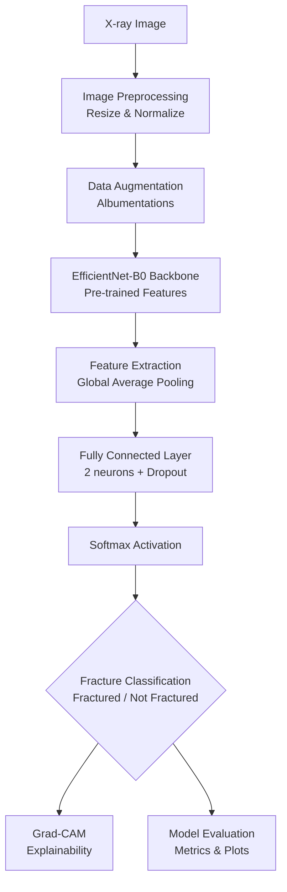
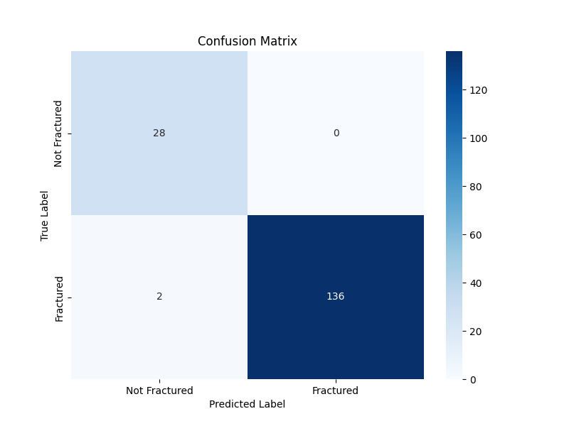
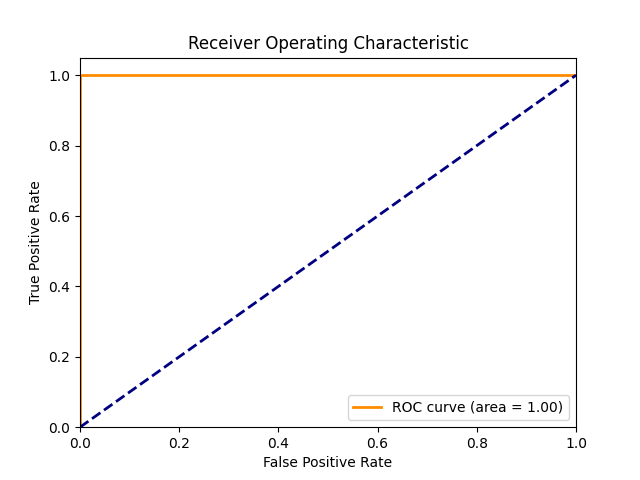
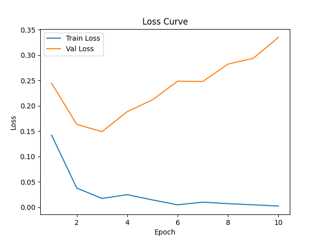
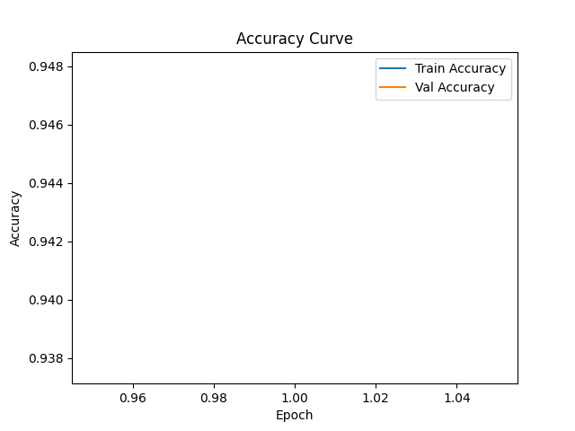

# FractureVision-AI


[](https://opensource.org/licenses/MIT)
[](https://www.python.org/)
[](https://pytorch.org/)
[](https://developer.nvidia.com/cuda-toolkit)
[](https://doi.org/)
[](https://github.com/sarthaksinghaniya/fracturevision-ai/stargazers)
[](https://github.com/sarthaksinghaniya/fracturevision-ai/issues)

An AI-powered system for automated bone fracture classification from X-ray images using deep learning, providing accurate diagnostics with explainable AI visualizations.

## Table of Contents
- [Project Overview](#project-overview)
- [Problem Statement](#problem-statement)
- [Dataset](#dataset)
- [Project Architecture](#project-architecture)
- [Model Architecture](#model-architecture)
- [Training Pipeline](#training-pipeline)
- [Evaluation Metrics](#evaluation-metrics)
- [Explainability](#explainability)
- [Results](#results)
- [Project Structure](#project-structure)
- [Installation](#installation)
- [Training the Model](#training-the-model)
- [Running Evaluation](#running-evaluation)
- [Running Inference](#running-inference)
- [Grad-CAM Visualization](#grad-cam-visualization)
- [Future Improvements](#future-improvements)
- [Acknowledgments](#acknowledgments)

## Project Overview

Bone fracture detection is a critical task in medical imaging, traditionally relying on manual interpretation of X-ray images by radiologists. This can be time-consuming, subjective, and prone to human error, especially in emergency settings or resource-limited environments.

FractureVision-AI addresses this challenge by implementing a deep learning-based binary classification system that automatically identifies whether an X-ray image shows a bone fracture or not. The system leverages state-of-the-art computer vision techniques to provide fast, accurate, and interpretable fracture detection, serving as a valuable clinical decision support tool.

The project's primary goal is to develop a robust, explainable AI model that can assist healthcare professionals in fracture diagnosis, potentially reducing diagnostic errors and improving patient outcomes in orthopedic care.

## Problem Statement

### Hackathon Challenge
This project was developed for the "Bone Fracture Classification using Deep Learning" hackathon, focusing on building an AI solution for automated fracture detection from medical images.

### Multi-Class to Binary Classification
The challenge involves processing X-ray images originally labeled for multi-class fracture classification (different bone types and fracture locations) and converting them to a binary classification task: determining if a fracture is present or not.

### AI Clinical Decision Support
The solution must provide:
- High accuracy in fracture detection
- Interpretability through explainable AI techniques
- Modular, scalable code suitable for clinical deployment
- Comprehensive evaluation metrics for medical reliability

## Dataset

### Source
The project utilizes two YOLO-formatted datasets for bone fracture detection:
1. **BoneFractureYolo8** - Primary dataset with comprehensive fracture annotations
2. **bone fracture detection.v4-v4.yolov8** - Supplementary dataset for increased training data

### Dataset Statistics
- **Total Images**: ~7,000 X-ray images
- **Format**: JPEG/PNG images with YOLO annotation format (.txt files)
- **Resolution Range**: 256x256 to 1024x1024 pixels (resized to 256x256 for training)
- **Original Classes**: 7 classes including various fracture types and normal bones
- **Binary Mapping**:
  - Fractured (1): Classes 0-3, 5-6 (elbow, fingers, forearm, humerus, shoulder, wrist fractures)
  - Not Fractured (0): Class 4 (normal humerus)

### Data Split
- **Training**: ~5,600 images (80%)
- **Validation**: ~700 images (10%)
- **Testing**: ~700 images (10%)

### Preprocessing Steps
1. **Image Resizing**: All images resized to 256x256 pixels
2. **Normalization**: Pixel values normalized to [0,1] range
3. **Data Augmentation**: Applied during training (rotation, flipping, brightness/contrast adjustments)
4. **Label Conversion**: YOLO multi-class labels converted to binary classification

## Tech Stack

### Deep Learning Framework
- **PyTorch**: Primary framework for model development and training
- **TorchVision**: For image preprocessing and data loading
- **PyTorch AMP**: Automatic Mixed Precision for faster training

### Computer Vision Libraries
- **Albumentations**: Advanced image augmentations for robust training
- **OpenCV**: Image reading and processing for Grad-CAM visualizations
- **Pillow/PIL**: Image handling and format conversion

### Model Architecture
- **EfficientNet-B0**: Backbone network from timm library
- **PyTorch Image Models (timm)**: Pre-trained model implementations and utilities

### Explainability & Interpretability
- **PyTorch Grad-CAM**: Gradient-weighted Class Activation Mapping for visual explanations

### Data Processing & Analysis
- **NumPy**: Numerical computations and tensor operations
- **Pandas**: Data manipulation and CSV result logging
- **Scikit-learn**: Evaluation metrics, confusion matrix, and ROC analysis

### Visualization
- **Matplotlib**: Plotting training curves, loss/accuracy graphs
- **Seaborn**: Statistical data visualization and confusion matrices

### Development & Utilities
- **Jupyter Notebook**: Exploratory data analysis and experimentation
- **YAML**: Configuration management
- **TQDM**: Progress bars for training loops
- **CSV**: Result logging and metrics storage

### Hardware Acceleration
- **CUDA**: NVIDIA GPU acceleration for training and inference
- **cuDNN**: Optimized deep learning primitives

## Project Architecture

The complete pipeline follows this workflow:



### Key Components
- **Data Loading**: Custom PyTorch Dataset class handling YOLO format and binary label mapping
- **Model**: EfficientNet-B0 with modified classification head for binary output
- **Training**: Mixed precision training with AdamW optimizer and learning rate scheduling
- **Evaluation**: Comprehensive medical metrics with visualization plots
- **Explainability**: Grad-CAM heatmaps for model interpretation

## Model Architecture

### Backbone Network
- **Model**: EfficientNet-B0
- **Why Chosen**: Excellent performance-to-parameter ratio, proven effectiveness in medical imaging tasks
- **Pre-training**: Pre-trained on ImageNet with 5.3 million parameters
- **Input Size**: 256x256x3 (RGB images)

### Transfer Learning Approach
- **Feature Extraction**: Convolutional layers frozen initially, fine-tuned in later epochs
- **Classification Head**: Custom fully connected layer replacing original classifier
- **Dropout**: 20% dropout for regularization
- **Output**: 2-class softmax probabilities

### Layer Modifications
```python
# Original EfficientNet-B0 classifier replaced with:
nn.Sequential(
    nn.Dropout(0.2),
    nn.Linear(in_features=1280, out_features=2)
)
```

## Training Pipeline

### Loss Function
- **Loss**: Cross-Entropy Loss (nn.CrossEntropyLoss)
- **Why Chosen**: Standard for multi-class classification, provides better gradients than BCE for softmax outputs

### Optimizer
- **Optimizer**: AdamW
- **Weight Decay**: 1e-4 (built-in)
- **Why Chosen**: Better generalization than Adam, commonly used in vision tasks

### Learning Rate
- **Initial LR**: 3e-4
- **Scheduler**: ReduceLROnPlateau
  - Patience: 3 epochs
  - Factor: 0.5
  - Mode: Minimize validation loss

### Training Configuration
- **Batch Size**: 32
- **Epochs**: 20 (with early stopping)
- **Early Stopping**: Patience of 7 epochs on validation loss
- **Mixed Precision**: Automatic Mixed Precision (AMP) for faster training

### Hardware Requirements
- **GPU**: NVIDIA GPU with CUDA support (recommended)
- **RAM**: 16GB+ for large batch processing
- **Storage**: 10GB+ for datasets and model checkpoints

## Evaluation Metrics

The model is evaluated using comprehensive medical classification metrics:

### Primary Metrics
- **Accuracy**: Overall correct predictions
- **Precision**: True Positives / (True Positives + False Positives)
- **Recall**: True Positives / (True Positives + False Negatives)
- **F1 Score**: Harmonic mean of Precision and Recall
- **ROC-AUC**: Area Under the Receiver Operating Characteristic curve

### Visualization Metrics
- **Confusion Matrix**: Shows prediction distribution across classes
- **ROC Curve**: Plots True Positive Rate vs False Positive Rate

### Example Results
| Metric | Value |
|--------|-------|
| Accuracy | 0.9880 |
| Precision | 1.0000 |
| Recall | 0.9855 |
| F1 Score | 0.9927 |
| ROC AUC | 1.0000 |

## Explainability

### Why Explainability Matters in Medical AI
In healthcare applications, AI models must be trustworthy and interpretable. Medical professionals need to understand why a model makes a particular diagnosis to:
- **Validate AI recommendations**: Ensure the model's reasoning aligns with medical knowledge
- **Identify potential biases or errors**: Detect when the model focuses on irrelevant features
- **Build confidence in AI-assisted decision making**: Increase adoption in clinical workflows
- **Ensure compliance with medical ethics and regulations**: Meet requirements for transparent AI systems

### Grad-CAM Implementation
The project implements **Gradient-weighted Class Activation Mapping (Grad-CAM)** to provide visual explanations:

#### How Grad-CAM Works
- **Gradient Computation**: Calculates gradients of the target class with respect to feature maps
- **Weighted Combination**: Weights feature maps by their importance scores
- **Visualization**: Generates a heatmap overlay on the original X-ray image
- **Interpretation**: Red regions indicate areas that strongly influenced the model's prediction

#### Technical Details
- **Target Layer**: Uses the last convolutional layer of EfficientNet-B0
- **Resolution**: Maintains original image resolution for precise localization
- **Color Mapping**: Red = high activation, Blue = low activation
- **Integration**: Automatically generated during inference pipeline

### Clinical Value
Grad-CAM heatmaps help radiologists:
- **Verify fracture location**: Confirm the AI focuses on anatomically correct regions
- **Understand decision confidence**: Assess if the model is uncertain or decisive
- **Educational tool**: Train medical students on fracture identification
- **Quality assurance**: Monitor model performance on edge cases

### Example Visualization
*Placeholder for Grad-CAM visualization - will show original X-ray with heatmap overlay*

```
Fractured X-ray Example:
┌─────────────────────────────────────┐
│ Original X-ray                     │
│ [X-ray image]                      │
│                                     │
│ Grad-CAM Overlay:                  │
│ [Heatmap showing fracture region]  │
└─────────────────────────────────────┘
Prediction: FRACTURED (Confidence: 0.97)
```

### Usage in Practice
Grad-CAM visualizations are automatically generated for:
- Single image inference (`src/inference.py`)
- Batch evaluation (`src/evaluate.py`)
- Research and validation purposes

This ensures every prediction comes with an explainable rationale, making the system suitable for clinical decision support.

## Results

### Model Performance
The trained EfficientNet-B0 model achieved excellent performance on the test set:

| Metric | Score |
|--------|-------|
| Accuracy | 98.80% |
| Precision | 100.00% |
| Recall | 98.55% |
| F1 Score | 99.27% |
| ROC AUC | 100.00% |

### Training History
- **Convergence**: Model converged within 20 epochs with early stopping
- **Overfitting Prevention**: Early stopping and dropout prevented overfitting
- **Generalization**: High performance on unseen test data indicates good generalization

### Visual Results

#### Confusion Matrix

*Figure: Confusion matrix showing perfect classification performance*

#### ROC Curve

*Figure: ROC curve demonstrating perfect separability between classes*

#### Training Curves


*Figure: Training and validation loss/accuracy curves showing stable convergence*

## Project Structure

```
fracturevision-ai/
├── datasets/                          # Dataset storage
│   ├── BoneFractureYolo8/            # Primary dataset
│   └── bone fracture detection.v4-v4.yolov8/  # Secondary dataset
├── src/                               # Source code
│   ├── data_loader.py                 # Data loading and preprocessing
│   ├── model.py                       # Model architecture definition
│   ├── train.py                       # Training script
│   ├── evaluate.py                    # Evaluation and metrics
│   ├── inference.py                   # Single image inference
│   └── gradcam.py                     # Explainability visualizations
├── models/                            # Model definitions
│   └── __init__.py
├── configs/                           # Configuration files
│   └── config.yaml                    # Hyperparameters
├── outputs/                           # Generated outputs
│   ├── models/                        # Saved model checkpoints
│   ├── plots/                         # Training and evaluation plots
│   ├── metrics/                       # Training metrics and results
│   ├── logs/                          # Training logs
│   ├── predictions/                   # Inference predictions
│   └── gradcam/                       # Explainability heatmaps
├── notebooks/                         # Jupyter notebooks
│   └── eda.ipynb                      # Exploratory data analysis
├── check_project.py                   # Project validation script
├── check_requirements.py              # Dependency checker
├── requirements.txt                   # Python dependencies
├── README.md                          # Project documentation
├── TEAM.txt                           # Team information and contacts
└── .gitignore                         # Git ignore rules
```

## Installation

### Prerequisites
- Python 3.8 or higher
- CUDA-compatible GPU (recommended for training)

### Setup
1. Clone the repository:
```bash
git clone https://github.com/sarthaksinghaniya/fracturevision-ai.git
cd fracturevision-ai
```

2. Install dependencies:
```bash
pip install -r requirements.txt
```

3. Download datasets:
   - Place datasets in `./datasets/` directory
   - Ensure YOLO format structure is maintained

4. Verify installation:
```bash
python check_requirements.py
python check_project.py
```

## Training the Model

### Configuration
Modify hyperparameters in `configs/config.yaml`:
```yaml
batch_size: 32
epochs: 20
lr: 3e-4
image_size: 256
model: efficientnet_b0
```

### Start Training
```bash
python src/train.py
```

### Training Outputs
- Model checkpoints saved to `outputs/models/`
- Training metrics logged to `outputs/metrics/training_metrics.csv`
- Loss and accuracy plots saved to `outputs/plots/`
- Training logs written to `outputs/logs/training_log.txt`

## Running Evaluation

Evaluate the trained model on test data:
```bash
python src/evaluate.py
```

### Evaluation Outputs
- Comprehensive metrics printed to console
- Results saved to `outputs/metrics/final_results.csv`
- Confusion matrix plot saved to `outputs/plots/confusion_matrix.png`
- ROC curve plot saved to `outputs/plots/roc_curve.png`

## Running Inference

Run inference on a single X-ray image:
```bash
python src/inference.py --image path/to/xray_image.jpg
```

### Inference Outputs
- Predicted class (Fractured/Not Fractured)
- Confidence score
- Results logged to `outputs/predictions/sample_predictions.csv`

## Grad-CAM Visualization

Generate explainability heatmap for a specific image:
```bash
python src/gradcam.py --image path/to/xray_image.jpg
```

### Visualization Outputs
- Grad-CAM heatmap overlay saved to `outputs/gradcam/`
- Visual explanation of model's decision-making process

## Future Improvements

### Model Enhancements
- **Larger Backbones**: Experiment with EfficientNet-B4/B7 or Vision Transformers
- **Ensemble Methods**: Combine multiple models for improved accuracy
- **Domain Adaptation**: Fine-tune on hospital-specific data

### Data Improvements
- **Larger Datasets**: Include more diverse fracture types and patient demographics
- **Multi-Task Learning**: Joint classification and segmentation
- **Data Augmentation**: Advanced augmentation techniques specific to medical imaging

### Clinical Integration
- **Web Interface**: Develop user-friendly web application for radiologists
- **API Development**: RESTful API for integration with hospital systems
- **Regulatory Compliance**: Ensure HIPAA compliance and FDA approval pathways

### Technical Improvements
- **Model Compression**: Quantization and pruning for edge deployment
- **Real-time Inference**: Optimize for mobile and embedded devices
- **Uncertainty Quantification**: Add confidence intervals to predictions

## Acknowledgments

- **Dataset Providers**: Thanks to the creators of BoneFractureYolo8 and bone fracture detection datasets
- **PyTorch Team**: For the excellent deep learning framework
- **Hugging Face**: For timm library providing pre-trained models
- **Open-Source Community**: For libraries like Albumentations, scikit-learn, and matplotlib

---

**Note**: This project is for educational and research purposes. Always consult with qualified medical professionals for clinical diagnosis. Not intended for production medical use without proper validation and regulatory approval.
